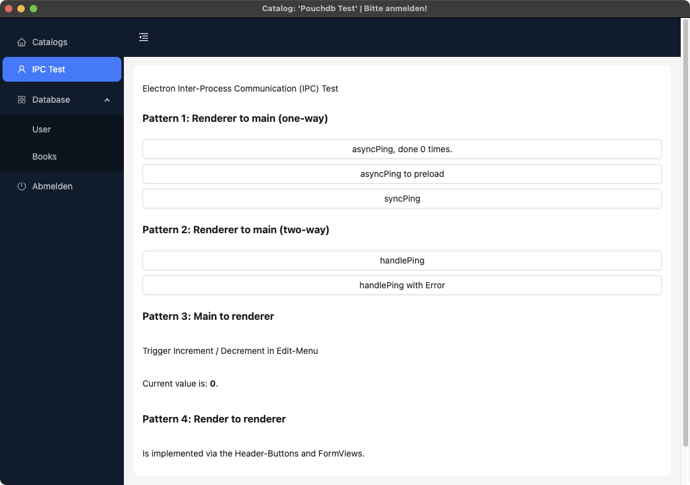
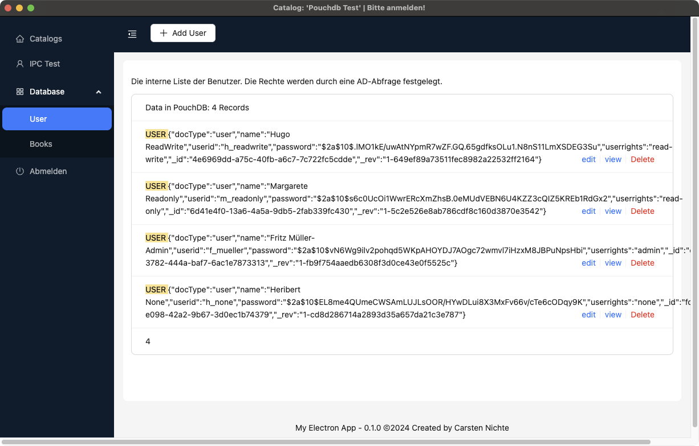
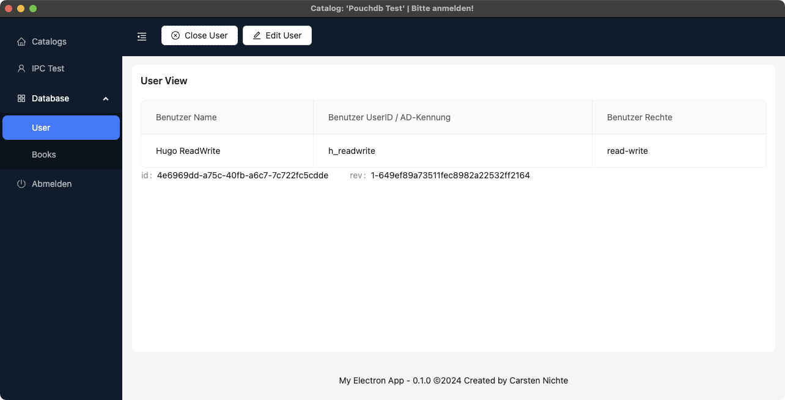

# Electron Typescript-React-Starter Application 2024

* A minimalistic (as possible) startingpoint, following the official guides, and avoiding some pitfalls.
* It was important to me that all dependent packages are up to date.
* I didn't test the app for all possible and impossible scenarios, only for my very specific requirements.
* It ist my public playground, where i test out concepts and implementations for my apps.

Goals

* Explore the [Electron Inter-Process Communication](https://www.electronjs.org/de/docs/latest/tutorial/ipc) (IPC), especialy the [Message ports](https://www.electronjs.org/de/docs/latest/tutorial/message-ports).
* Execute CRUD-Operations via the IPC-Protocol.
* Take the tour with Andt-Design.
* Provide a sort of basic framework for real-life use cases.
* Make the whole process easy as possible to understand and follow.

it bundles latest

* [Electron](https://www.electronjs.org)
* [Electron-Forge](https://www.electronforge.io)
* [Typescript](https://www.typescriptlang.org)
* [React](https://react.dev)
* [Antd Design](https://ant.design)
* [Pouchdb](https://pouchdb.com/guides/)
* [Electron Conf](https://github.com/alex8088/electron-conf)

If you also want to build an app with this setup, this could be a good starting point for you. Please note: I am travelling with Mac OS, but do my builds also an Windows (Linux is untested so far).

## Framework Concepts

* Introducing ViewTypes: `list`, `view`, `form`.
* Introducing DocTypes, such as `book`,`user`, `ipc`, or whatever you need.
* loading `json` Example-Data to couchdb to initialize a database.
  * see `assets/docs-json/`, `src/app/backend/Database_Pouchdb.ts` and `src/app/backend/DocumentCreator.ts`.
* Catalog-Module for local and remote pouchdb stores.
  * local stores can be backuped to zip archives.
  * switch between stores on the fly.
* User-Management and Login
  * Provide a Login-form
  * Provide User-Management / Users and Roles (add, remove)
  * Encrypt and decrypt data to store them localy via Elecron-Conf
  * persist current user, for automatic login.

## React Pitfalls

* Trigger Button-Actions from the global Header-Menue, and request actions from the underlying indipendent Components.

## How it Looks

Login Screen. The session stays open if you wish, so you will logged in automatically on next startup.


Database. Settings and switch. This is an example for a `List`. The Name of the active catalog shows up in the Application-Title.


IPC Ping-Pong. Note that the header buttons can also be hidden/deactivated.



Example-Module User-`List`. THis is a non-editable list of a bunch of enties.



Example-Module User-`View`. THis is a non-editable view of a single entry from the list.



Example-Module User-`Form`. A Formular, to create, or update Data:


## Use the Repo

### Preparations

node, npm and yarn should be in place:

### Setting up the Dev-Environment on Mac-OS

* Guides:
* <https://docs.npmjs.com/downloading-and-installing-node-js-and-npm>
* <https://classic.yarnpkg.com/lang/en/docs/install/#mac-stable>

### Setting up the Dev-Environment on Windows

follows

### Recomended VisualStudioCode Plugins

I love to use these along with [VS-Code](https://code.visualstudio.com/download):

* [Better Comments](https://marketplace.visualstudio.com/items?itemName=aaron-bond.better-comments)
* [Project Manager](https://marketplace.visualstudio.com/items?itemName=alefragnani.project-manager)
* [Todo Tree](https://marketplace.visualstudio.com/items?itemName=Gruntfuggly.todo-tree)
* [WakaTime](https://marketplace.visualstudio.com/items?itemName=WakaTime.vscode-wakatime)
  * with self hosted [wakapi](https://github.com/muety/wakapi)
* [Prettier - Code formatter](https://marketplace.visualstudio.com/items?itemName=esbenp.prettier-vscode)

### Setting up the Dev-Environment on Linux / Ubuntu 24.04

```bash
# install VS-Code
sudo dpkg -i code_1.90.1-1718141439_amd64.deb
# install git
sudo apt-get install git
# install npm, node and yarn
npm install -g npm
npm install --global yarn
# check
node -v
npm -v
yarn -v

# https://github.com/nodesource/distributions?tab=readme-ov-file#debian-and-ubuntu-based-distributions
sudo apt-get install -y curl
curl -fsSL https://deb.nodesource.com/setup_22.x -o nodesource_setup.sh
sudo -E bash nodesource_setup.sh
sudo apt-get install -y nodejs
node -v

# install rpmbuild
sudo apt-get install rpm
# check dpkg
dpkg --version
# install fakeroot
sudo apt-get update -y
sudo apt-get install -y fakeroot

# An unhandled rejection has occurred inside Forge:
# Error: node-gyp failed to rebuild
# ModuleNotFoundError: No module named 'distutils'
# https://github.com/electron/rebuild/issues/1116

sudo apt install python3-pip
pip install setuptools
```

runs and makes

### Clone the git repository

* Guide: <https://learn.microsoft.com/en-us/azure/developer/javascript/how-to/with-visual-studio-code/clone-github-repository>

* Clone git from <https://github.com/cnichte/basic-electron-typescript-react-starter.git>

```bash
npm install
# backup the .gitignore (rename it)
# then remove the existing git
rm -rf .git*
# and init your own
git init
# restore the backuped .gitignore
```

### run the commands

```bash
#start the app
npm start
# builds a zip in /out/make/zip/darwin/arm64
# you have to extract the zip an lauch the executable file
npm run make
# publish on github (has to be setup)
# npm run publish
```

`npm run make` builds a zipped App in the `out/make/` Folder.

* Should run without errors.
* Inspect the code for further reference.
* Have fun and success with your project.

## Login

Login with username = `f_mueller` and password `f_mueller`.
Example Users with different roles have username quals password.

## Update outdated packages

> [!IMPORTANT]
> be careful when updating.

> [!TIP]
> I do a quick local backup before updating, for an easy rollback if an update fails.

Check for outdated packages:

```bash
# check 
npm outdated
# or better use: npx npm-check-updates
ncu
# install ncu if absent
npm i npm-check-updates
# Guide: https://github.com/raineorshine/npm-check-updates
```

Use Cursor-Keys up and down to navigate, space to deselect, and enter to execute:

```bash
ncu -i --format group
```

> [!WARNING]
> In this case, updating all the `eslint` stuff leads to severe problems in Webpack which causes the build to fail.
> I have to wait until all installed dependent packages are updated.
> Dont update:

```bash
Patch   Backwards-compatible bug fixes
❯ ◉ @vercel/webpack-asset-relocator-loader    1.7.3  →    1.7.4
Minor   Backwards-compatible features
  ◯ @typescript-eslint/eslint-plugin        ^7.10.0  →  ^7.12.0
❯ ◯ @typescript-eslint/parser               ^7.10.0  →  ^7.12.0
Major   Potentially breaking API changes
❯ ◯ eslint  ^8.0.1  →  ^9.2.0
```

## make a release

```bash
# first build
npm run build
# then commit all changes to git, and then...
# create a version: major,minor,patch 
# patch: 1.0.0 -> 1.0.1
npm version major
npm version minor
npm version patch
```

## Customize to your needs in six steps

1. Customize `src/app/common/app-info.ts`
2. Add your type `mydoctype` to `src/app/common/types/DocType.ts`
3. Create a `DocMydoctype.ts` in `src/app/common/types/`
4. Create a new module folder in `/src/app/modules/mydoctype`, following the structure oft the example modules.
5. Add your routes to `src/app/frontend/types/RouteType.ts`
6. Add your routes to `src/app/frontend/App_Routes.tsx`
7. Add your module to the sidebar `src/app/frontend/Side_NavigationBar.tsx`

Dont forget to customize your `list`, `view` and `form`.

## History

How i set this up...

### Create Project and Install

* Guide: [www.electronforge.io](https://www.electronforge.io)

```bash
# in parent folder
npm init electron-app@latest basic-electron-typescript-react-starter -- --template=webpack-typescript
# in folder app-folder
npm install
```

```bash
npm warn deprecated gar@1.0.4: Package no longer supported. Contact Support at https://www.npmjs.com/support for more info.
npm warn deprecated @npmcli/move-file@2.0.1: This functionality has been moved to @npmcli/fs
npm warn deprecated xterm-addon-search@0.8.2: This package is now deprecated. Move to @xterm/addon-search instead.
npm warn deprecated xterm-addon-fit@0.5.0: This package is now deprecated. Move to @xterm/addon-fit instead.
npm warn deprecated asar@3.2.0: Please use @electron/asar moving forward.  There is no API change, just a package name change
npm warn deprecated xterm@4.19.0: This package is now deprecated. Move to @xterm/xterm instead.
```

```bash
npm install --save-dev @electron-forge/publisher-github
```

ignoring these (for now), and continue with:

```bash
# start the app - works
npm start
# make the app - works
npm run make
# publish on github (has to be setup)
npm run publish
```

make warnings:

```bash
(node:10577) [DEP0174] DeprecationWarning: Calling promisify on a function that returns a Promise is likely a mistake.
(Use `node --trace-deprecation ...` to show where the warning was created)
```

publish has to be setup.

### Add Debugging in VSCode

* Guide: <https://www.electronjs.org/docs/latest/tutorial/debugging-vscode>

Add a file `.vscode/launch.json` with the following configuration:

```json
{
  "version": "0.2.0",
  "configurations": [
    {
      "name": "Debug Main Process",
      "type": "node",
      "request": "launch",
      "cwd": "${workspaceFolder}",
      "runtimeExecutable": "${workspaceFolder}/node_modules/.bin/electron",
      "windows": {
        "runtimeExecutable": "${workspaceFolder}/node_modules/.bin/electron.cmd"
      },
      "args" : ["."],
      "outputCapture": "std"
    }
  ]
}
```

* Set some breakpoints in `main.js`.
* Start debugging in the [Debug View](https://code.visualstudio.com/docs/editor/debugging).

works

### Add React

* Guide: [electronforge.io/guides/framework-integration/react-with-typescript](https://www.electronforge.io/guides/framework-integration/react-with-typescript)

```bash
npm install --save react react-dom
npm install --save-dev @types/react @types/react-dom
```

works

### Adding IPC Support

* Guide: [electronjs.org/de/docs/latest/tutorial/ipc](https://www.electronjs.org/de/docs/latest/tutorial/ipc)

works

### App-Icon Support

* Guide:
* <https://www.electronforge.io/guides/create-and-add-icons>
* <https://stackoverflow.com/questions/31529772/how-to-set-app-icon-for-electron-atom-shell-app>

Problems:

* Windows
  * App Icon on  is blurred.
  * Installer has the Electron Default-Icon

### Antd-Design

* Guide: <https://ant.design/docs/react/introduce>

```bash
npm install antd --save
```

### React Router

```bash
npm i react-router
npm i react-router-dom
```

### PouchDB

* Guide: <https://pouchdb.com/guides/>

```bash
npm install pouchdb
npm install pouchdb-find
npm install pouchdb @types/pouchdb
npm i uuid
npm i --save-dev @types/uuid
```

tsconfig.json

```js
{
  "compilerOptions": {
    "allowSyntheticDefaultImports": true
  }
}
```

Creates a local `pouchdb-test` Database in the users home folder `~/my-electron-app/catalogs/`, on the first startup with `npm start`.

### Electron Conf

* Guide: <https://github.com/alex8088/electron-conf>

```bash
npm install electron-conf
```

Creates a local `settings.json` file in the users home folder `~/my-electron-app/`, on the first startup with `npm start`.

### Logger

* Guide: <https://github.com/megahertz/electron-log>
* <https://www.electronjs.org/de/docs/latest/api/net-log>

```bash
npm install electron-log
```

Logs in a logfile at the users home folder `~/my-electron-app/logs/`

works

### Internationalize localize

* <https://phrase.com/blog/posts/building-an-electron-app-with-internationalization-i18n/>
* <https://www.christianengvall.se/electron-localization/>
* <https://en.wikipedia.org/wiki/Internationalization_and_localization>

* <https://www.npmjs.com/package/typesafe-i18n>
* <https://formatjs.io/docs/getting-started/installation/>

```bash
npm install --save i18next i18next-node-fs-backend

```

pending

Research:

* <https://github.com/i18next/react-i18next>
* <https://muhammedcuma.medium.com/complete-guide-to-internationalization-in-react-using-react-i18n-15bfd7d736e8>
* <https://hygraph.com/blog/react-internationalization>
* <https://github.com/reZach/secure-electron-template/tree/master/app>
* <https://phrase.com/blog/posts/building-an-electron-app-with-internationalization-i18n/>

### Database backup

```bash
npm install zip-a-folder
npm install dayjs
```

### User Management and Login

* Encrypt and decrypt data to store them localy via Elecron-Conf
* Users and Roles

### SVG Support

Display an SVG Image in this environment - used on the Login Page.

* `npm install @svgr/webpack --save-dev`
* add to `webpack.rules.ts`
* create `custom.d.ts`
* add to `tsconfig.json`

### Sign the App

pending

### Electron DevTools

Two new tabs in your Chrome DevTools: "⚛️ Components" and "⚛️ Profiler".

* <https://github.com/MarshallOfSound/electron-devtools-installer>
* <https://chromewebstore.google.com/detail/react-developer-tools/fmkadmapgofadopljbjfkapdkoienihi>

```bash
npm install electron-devtools-installer --save-dev
```

* <https://nodejs.org/docs/latest-v16.x/api/cli.html#--enable-source-maps>

```bash
--enable-source-maps
```

### Issues (so far)

Multiple warnings during `npm run make` under Mac OS of this type:

```bash
(node:43477) [DEP0174] DeprecationWarning: Calling promisify on a function that returns a Promise is likely a mistake.
```

This needs to be investigated in more detail.
